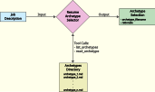
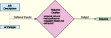
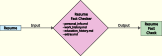
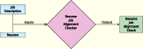
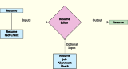

# ResumAI

[](https://github.com/kidthales/resumai/actions/workflows/ci.yaml)

A resume generation system that leverages LLMs.

## Requirements

- [Docker Compose](https://docs.docker.com/compose/install/) (v2.10+)
- [GNU Make](https://www.gnu.org/software/make/) and [GNU Bash](https://www.gnu.org/software/bash/)
- [Git](https://git-scm.com/install/)

## Quickstart

1. `git clone https://github.com/kidthales/resumai.git`
2. `cd resumai`
3. `make start`
    - First-time project starts will take a few minutes to complete while docker images are built and services are started.
    - Once started, Docker logging will continue in the current shell. When all services are healthy, the application is ready to accept commands in another shell.
4. Within the `content/pii/` directory, create and populate `education_history.md`, `extras.md`, `personal_info.md`, and `work_history.md` with your own information; refer to the corresponding sample files for guidance.
5. Within the `content/archetypes/` directory, create and populate at least 2–3 of your own git-ignored files with your own archetypes; refer to the corresponding sample files for guidance. Keep these archetypes aligned with the content you've added in `content/pii/work_history.md`.
6. Pull the required agent models used by the Ollama platform: `make ollama-pull`.
7. Open a web browser and navigate to https://aistudio.google.com/api-keys and click the _Create API key_ button.
    1. Create a new project or select an existing one.
    2. Copy the API key and save it in the git-ignored `.env.local` file as:
        ```dotenv
        GEMINI_API_KEY=<gemini_api_key>
        ```
8. Generate a general-purpose resume, based only on `content/pii/`, and write the result to `var/resume_draft.md`:
    ```shell
    make resume-draft c='var/resume_draft.md' # Ollama
    make resume-draft c='var/resume_draft.md --platform gemini' # Gemini
    ```

## Usage

> [!TIP]
> Use `make help` to reference available make targets and descriptions.

The app is composed of five commands (two of which are optional). The commands are designed to run in a sequence, but there is no explicit automation provided. The lack of automation is for two reasons:

1. Workflow flexibility.
2. Unreliability of free-tier and local LLM service/output. _**TODO:** Service issues can be mitigated with backoff/retry logic._

All commands support the `--platform ollama` and `--platform gemini` flags; by default, the `ollama` platform is used.

### 1. Resume Archetype Selector (Optional)

Given a **job description**, this agent compares it against a set of candidate **archetypes** (Markdown files located in `content/archetypes/`), and determines the best **archetype** (with corresponding rationale) that satisfies the **job description**. The agent will attempt to provide structured output (JSON), for example:

```json
{
    "archetype_filename": "technical_lead.sample.md",
    "rationale": "A brief explanation as to why this archetype was selected."
}
```



> [!NOTE]
> If at least one non-sample file exists in `content/archetypes/`, all sample files will be excluded from the `list_archetypes` tool call result. A non-sample file is any `*.md` that does not end with `*.sample.md`.

Examples:

```shell
# Output archetype selection to console only
make resume-arch c='path/to/input/job_description.txt'

# Output archetype selection to console and file
make resume-arch c='path/to/input/job_description.txt --output path/to/output/archetype_selection.json'
```

> [!TIP]
> `make resume-arch c='--help'`

### 2. Resume Drafter

This agent encapsulates the contents of `content/pii/` within its system prompt and will use that information to generate a **resume**. You may provide optional inputs, **job description** and/or **archetype**, to help tailor the generated **resume**.



Examples:

```shell
# Output a general-purpose resume
make resume-draft c='path/to/output/resume_draft.md'

# Output a resume tailored for job description
make resume-draft c='path/to/output/resume_draft.md --job path/to/input/job_description.txt'

# Output a resume tailored for archetype
make resume-draft c='path/to/output/resume_draft.md --archetype archetype_filename'

# Output a resume tailored for job description and archetype
make resume-draft c='path/to/output/resume_draft.md --job path/to/input/job_description.txt --archetype archetype_filename'
```

> [!TIP]
> `make resume-draft c='--help'`

### 3. Resume Checkers

These agent commands are designed to provide checks and feedback for a resume. Generated feedback can then be used with [step 4](#4-resume-editor).

> [!NOTE]
> These may also be used as standalone commands to check a hand-crafted resume.

#### 3.1. Resume Fact Checker

Similar to the `resume_drafter` agent, this agent encapsulates the contents of `content/pii/` within its system prompt but will use that information to **fact-check** a **resume** and generate a report.



Examples:

```shell
make resume-fc c='path/to/input/resume.md path/to/output/resume_fact_check.md'
```

> [!TIP]
> `make resume-fc c='--help'`

#### 3.2. Resume Job Alignment Checker (Optional)

This agent will perform a **job-alignment-check** for a given **resume** and **job description**, generating a report.



Examples:

```shell
make resume-jac c='path/to/input/resume.md path/to/input/job_description.txt path/to/output/resume_job_alignment_check.md'
```

> [!TIP]
> `make resume-jac c='--help'`

### 4. Resume Editor

This agent is responsible for accepting a **resume**, **resume fact-check**, and optionally a **resume job-alignment-check**, to generate an edited **resume** that is (hopefully) corrected and aligned.



Examples:

```shell
# Edit resume with only a resume fact-check
make resume-edit c='path/to/input/resume.md path/to/input/resume_fact_check.md path/to/output/resume.md'

# Edit resume with a resume fact-check and a resume job-alignment-check
make resume-edit c='path/to/input/resume.md path/to/input/resume_fact_check.md path/to/output/resume.md --job path/to/input/resume_job_alignment_check.md'
```

> [!TIP]
> `make resume-edit c='--help'`

## Content Structure

```
resumai/
└── content/
    ├── archetypes/                          # Candidate archetypes
    │   ├── .gitignore                       # Ignores all non-sample files
    │   └── *.sample.md                      # Sample archetype files
    │
    ├── pii/                                 # Personally Identifiable Information
    │   ├── .gitignore                       # Ignores all non-sample files
    │   ├── education_history.sample.md      # Sample education history file
    │   ├── extras.sample.md                 # Sample extras file
    │   ├── personal_info.sample.md          # Sample personal information file
    │   └── work_history.sample.md           # Sample work history file
    │
    └── prompts/                             # Agent prompts
        ├── resume_archetype_selector.md     # Resume archetype selector agent prompt
        ├── resume_drafter.md                # Resume drafter agent prompt
        ├── resume_editor.md                 # Resume editor agent prompt
        ├── resume_fact_checker.md           # Resume fact checker agent prompt
        └── resume_job_alignment_checker.md  # Resume job alignment checker agent prompt
```

## Licenses

Application source code and content are licensed under the GNU Affero General Public License v3.0 or later. See [LICENSE](./LICENSE) for the full license text.

Docker FrankenPHP image is licensed under the MIT License. See [docker/php/LICENSE](./docker/php/LICENSE) for the full license text.

Symfony is licensed under the MIT License. See https://github.com/symfony/symfony/blob/8.1/LICENSE for the full license text.
